# clox

Fullscreen analog + vintage-digital clock screensavers, rendered on a single
`<canvas>` at 60 fps. Zero dependencies, zero build step — double-click
`index.html` or run `clox.bat` for instant kiosk-mode fullscreen.

Resolution-independent: everything is drawn relative to the window size with
`devicePixelRatio` scaling, so 1080p, 1440p (2K), and 4K all render crisp.

## Faces

| | |
|---|---|
| 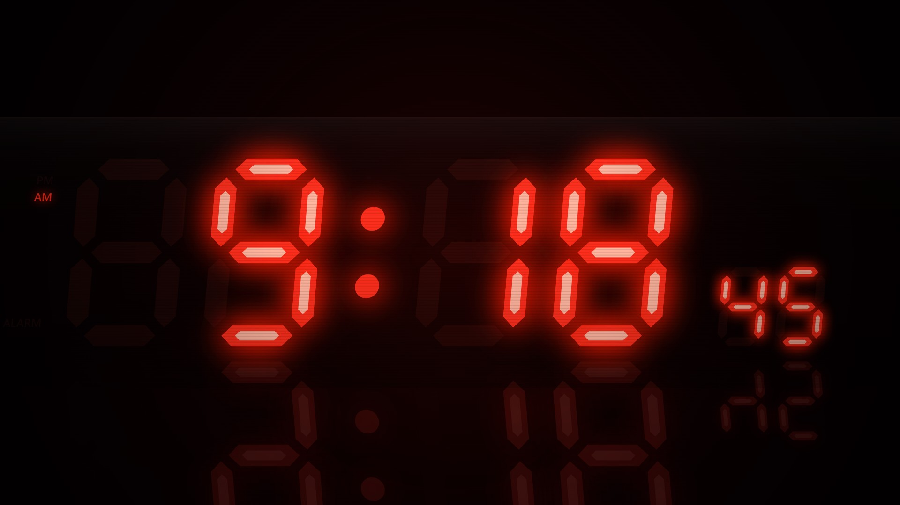 **Redline · 80s LED** — red seven-segment alarm clock: ghost segments, bloom, blinking colon, PM/ALARM indicators, scanlines, floor reflection | 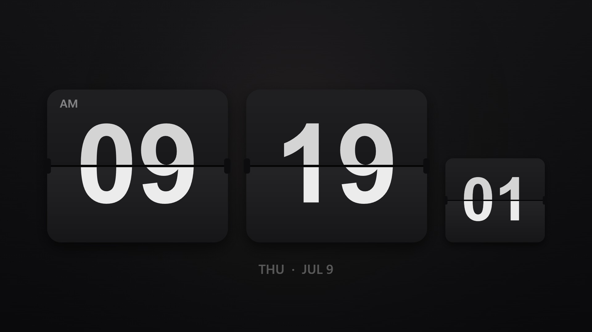 **Flip · Solari** — split-flap cards with gravity-eased flap animation, axle pins, AM/PM tag, date line |
| 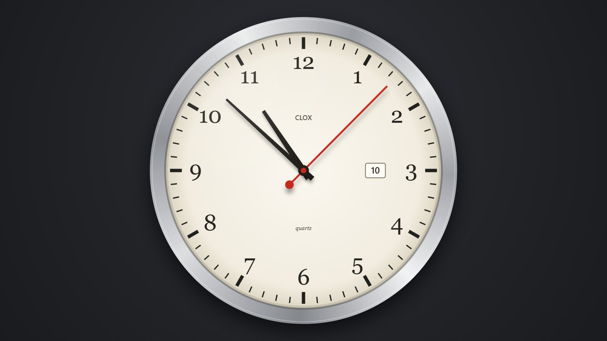 **Sweep · Wall Clock** — brushed-metal bezel, ivory dial, serif numerals, date window, continuous sweep second hand | 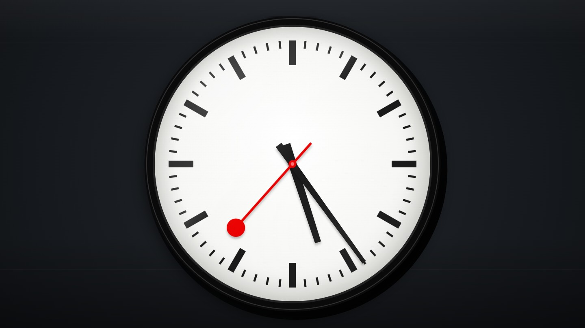 **Station · Swiss Railway** — red lollipop second hand sweeps in 58.5s and pauses at 12; minute hand snaps with spring overshoot |
| 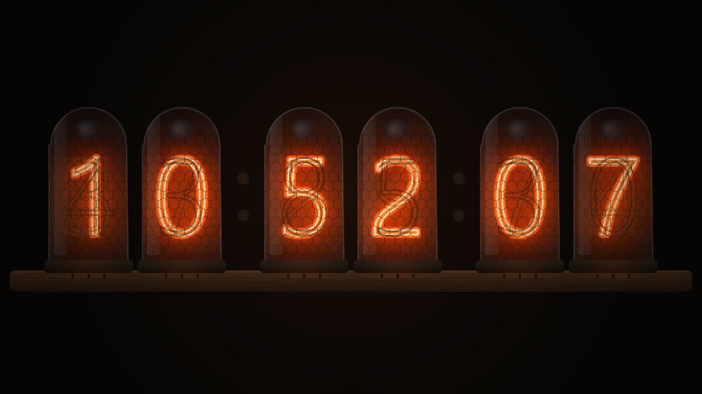 **Nixie · IN-18** — glass tubes on a walnut base, unlit cathode stacks, honeycomb anode mesh, neon-dot separators | 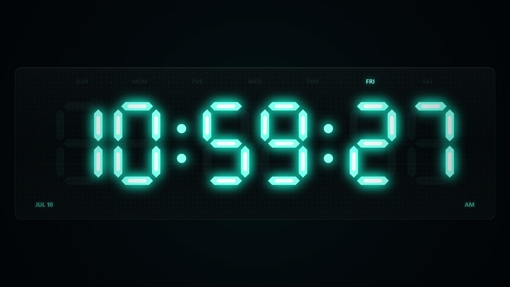 **VFD · Hi-Fi** — cyan vacuum-fluorescent display behind receiver glass, weekday indicator row, dot-matrix texture |
| 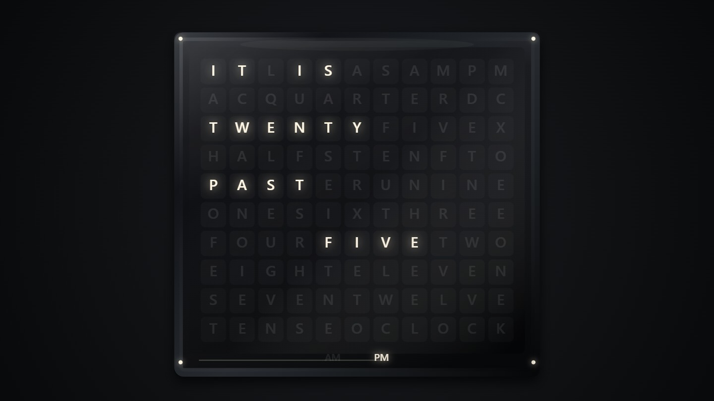 **Wordgrid · Word Clock** — 11×10 letter grid; the time lights up as a sentence, corner dots count the extra minutes | 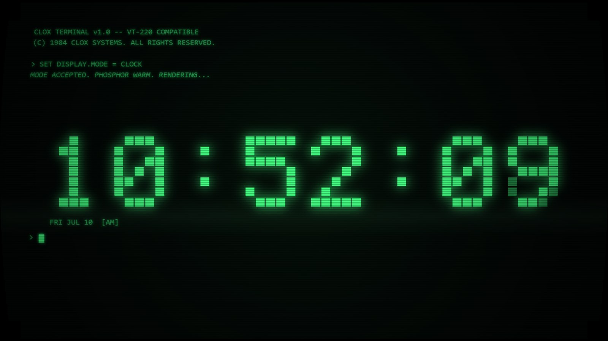 **Terminal · CRT** — green phosphor, typed boot sequence, 5×7 pixel-block digits, scanlines, refresh band, blinking cursor |
| 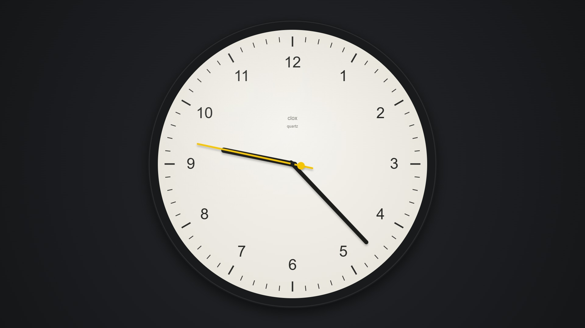 **Braun · Minimal** — Rams-school dial, stick hands, yellow second hand that steps each second with a mechanical overshoot | 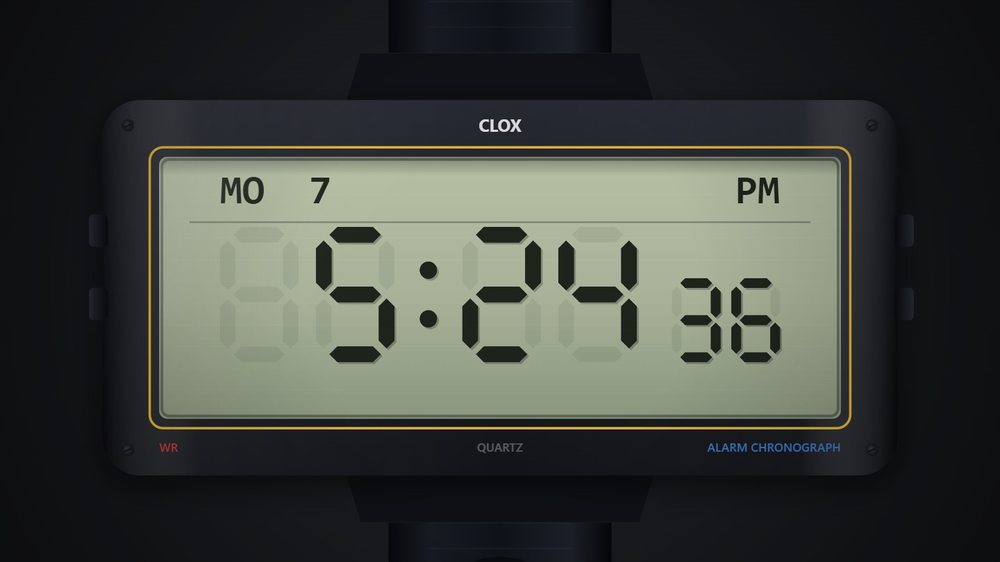 **LCD · Digital Watch** — F-91W-style liquid crystal: dark segments with depth shadow, day/date header, resin bezel accents |
| 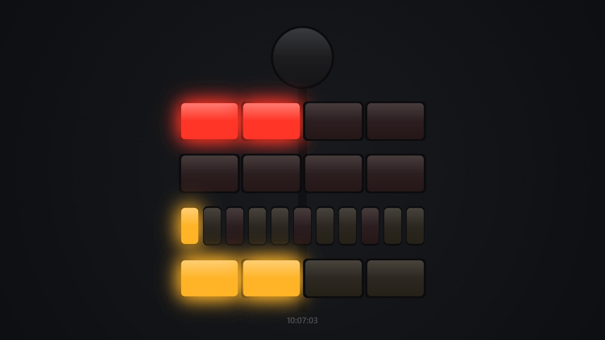 **Berlin · Mengenlehreuhr** — the 1975 set-theory clock: blinking seconds lamp, 5-hour and 1-hour red rows, 5-minute row with red quarters, 1-minute yellow row | 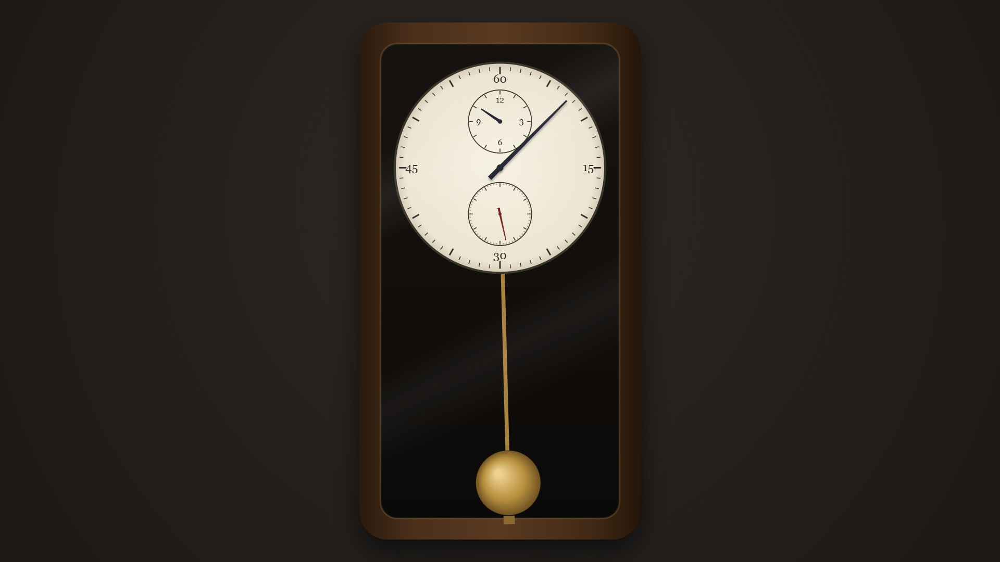 **Regulator · Pendulum** — watchmaker's regulator dial (central minute hand, hour + seconds sub-dials) with a swinging brass pendulum in a walnut case |
| 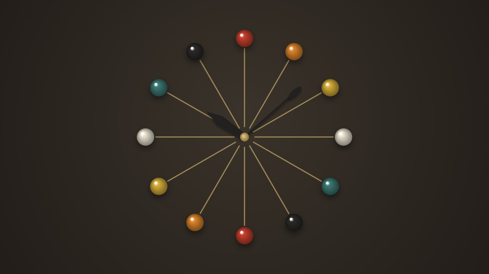 **Nelson · Ball Clock** — the 1949 mid-century starburst: lacquered balls on brass spokes, paddle hour hand, elliptical minute tip | 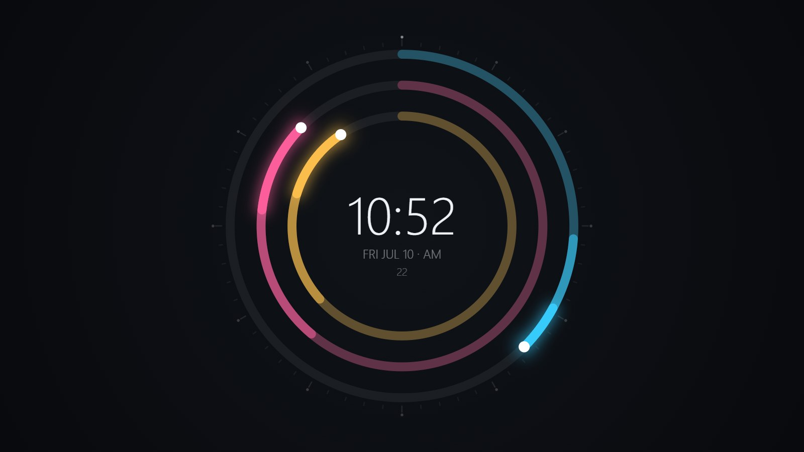 **Polar · Radial Arcs** — modern concentric progress arcs for hours/minutes/seconds with glowing endpoints and a thin digital readout |
| 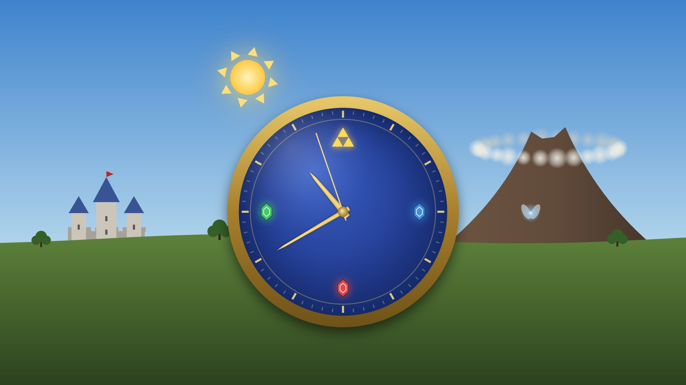 **Ocarina · Hyrule Field** — world clock: real day/night sky with arcing sun and moon, smoke-ringed volcano, blue-roofed castle, blue-ceramic gold-banded dial with rupee markers, and a wandering fairy | 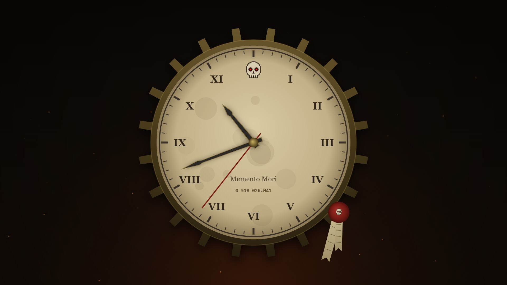 **Grimdark · M41** — brass cog, parchment dial, servo-skull at twelve with burning eyes, blade hands, wax purity seal, rising embers, and a real Imperial datestamp |
| 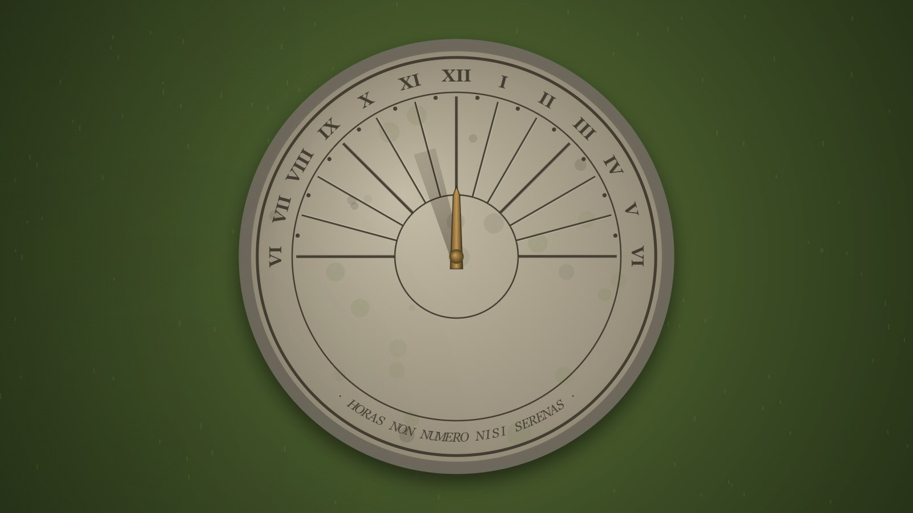 **Sundial · Garden Stone** — the gnomon's shadow IS the clock: 15°/hour across engraved Roman hour lines, longer toward dawn and dusk; moon-shadow and fireflies after dark | 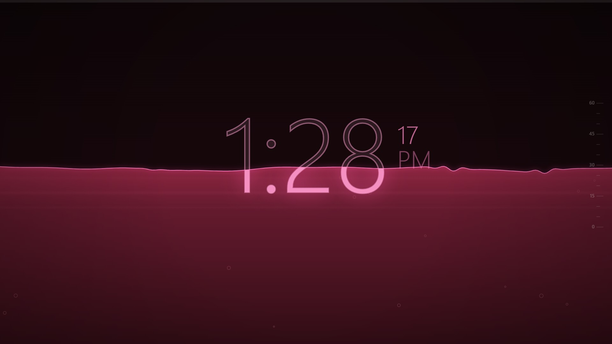 **Liquid · Reactive Pool** — the waterline climbs the digits through the hour (halfway up at :30, drowning them by :59); a droplet splashes real ripples every second, the surface stirs when you move the mouse, and `C` cycles color presets (Auto 24h drift, Tidepool Teal, Deep Ocean, Ultraviolet, Gothic Rose, Molten Ember, Reactor Acid) |

## Run it

- **Kiosk / screensaver mode:** double-click `clox.bat` (Chrome, falls back to Edge). `Alt+F4` or `Ctrl+W` to exit.
- **Normal:** open `index.html` in any Chromium browser, press `F` or click for fullscreen.

While fullscreen, clox requests a screen wake lock so the display stays on.

## Controls

| Key | Action |
|---|---|
| `←` / `→` / `Space` | Switch face |
| `F` / click | Toggle fullscreen |
| `S` | Toggle seconds |
| `H` | Toggle 12/24-hour |
| `A` | Auto-cycle faces every 2 minutes |
| `C` | Cycle color preset (Liquid face) |
| `?` | Show help |

Settings and the last face persist in `localStorage`.

## Use as a Windows screensaver

Windows `.scr` files are just renamed executables, so a true `.scr` needs a
native wrapper. The practical setups:

1. **Manual:** run `clox.bat` when stepping away (set Windows *Screen timeout*
   to Never while it runs — the wake lock handles this in fullscreen).
2. **Task Scheduler:** trigger `clox.bat` on idle (Task Scheduler → trigger
   "On idle") and disable the stock screensaver.

## Architecture

```
index.html          script tags (classic, not ESM — file:// safe)
css/style.css       canvas fill, toast/hint overlays, cursor hiding
js/util.js          registry, easings, time parts, seven-segment renderer
js/engine.js        rAF loop, DPR resize, input, settings, wake lock
js/faces/*.js       one file per face; each calls CLOX.register({id, name, draw})
```

Adding a face: create `js/faces/myface.js`, call
`CLOX.register({ id, name, draw(ctx, W, H, date, settings, now) })`,
add a `<script defer>` tag to `index.html`. `W`/`H` are CSS pixels
(DPR already applied to the context transform).

Classic scripts instead of ES modules is deliberate: Chrome blocks module
imports over `file://`, and a screensaver must work with a double-click.
