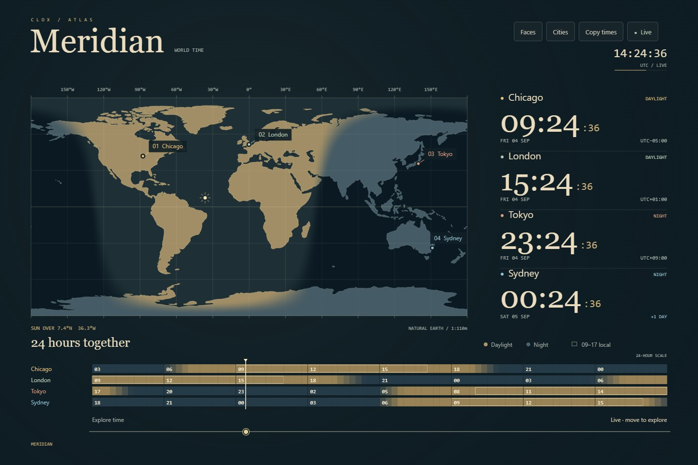
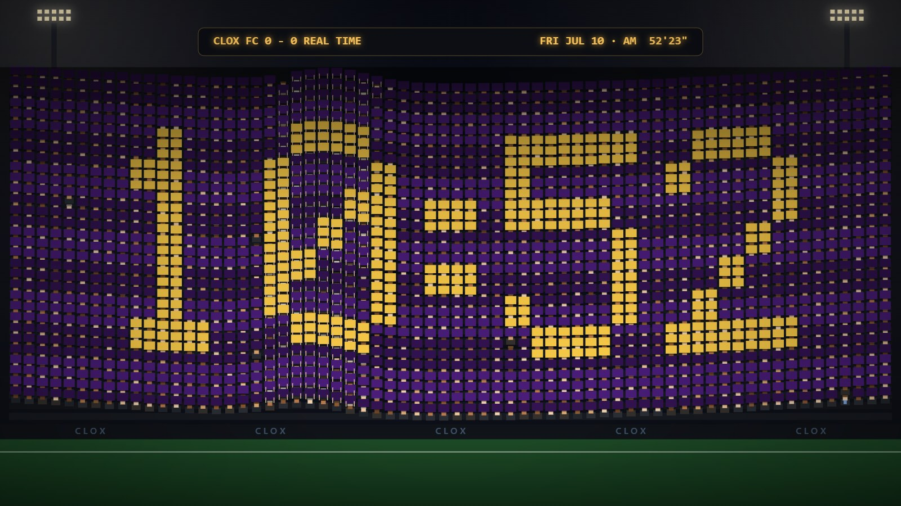
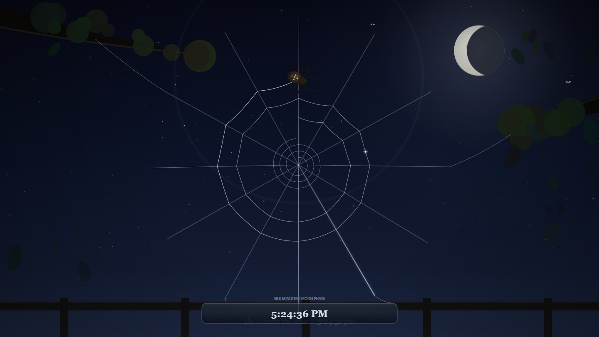
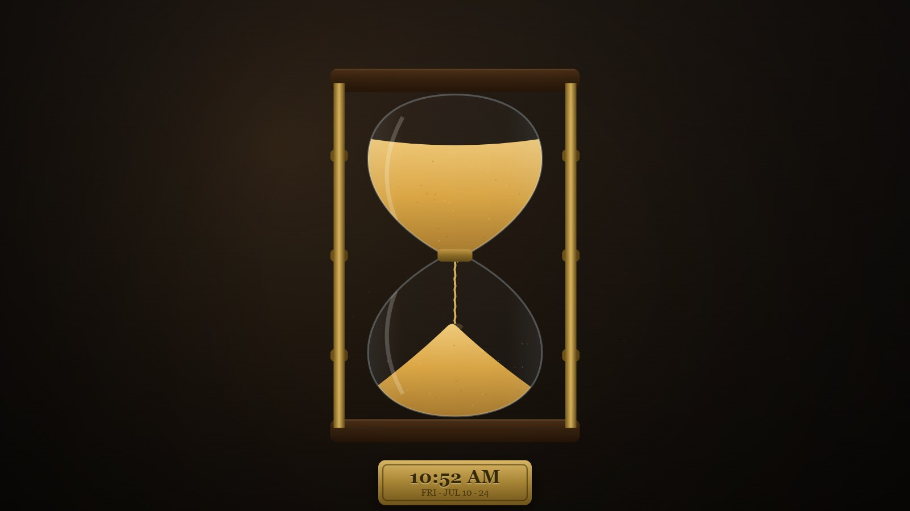
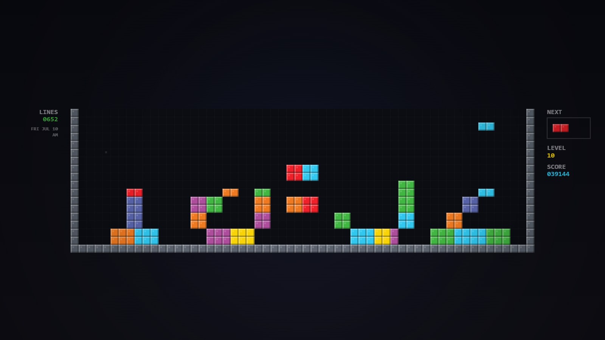
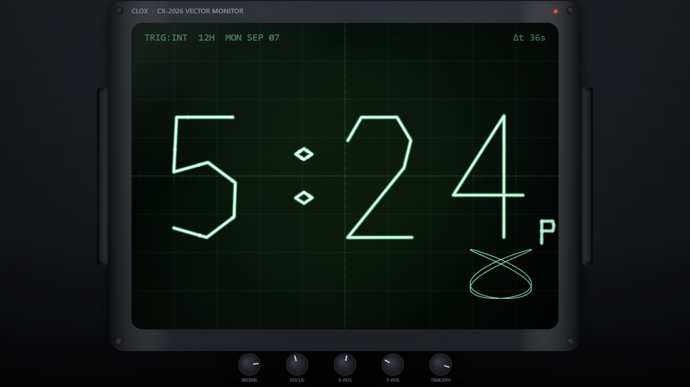

# clox

Fullscreen analog + vintage-digital clock screensavers, rendered on a single
`<canvas>` at 60 fps. Zero dependencies, zero build step — double-click
`index.html` or run `clox.bat` for instant kiosk-mode fullscreen.

Resolution-independent: everything is drawn relative to the window size with
`devicePixelRatio` scaling (capped at 2×), so 1080p, 1440p (2K), and 4K all
render crisp.

## Meridian · World Time

Press **M** for an atlas clock with four cities, a moving day/night boundary,
and aligned timelines. Everything runs locally, including the map.



- **Cities** selects four places from 38 locations. Choices stay on this device;
  the first city is the reference for the `+1 DAY` / `−1 DAY` labels.
- **Explore time** moves every clock and the map to the same instant. The range
  spans 24 elapsed hours, starting six hours before the current UTC hour. Local
  time follows daylight-saving rules, including skipped and repeated hours.
- **Live** or `Escape` while using the slider returns to the current time.
  Exploring pauses auto-cycle; the tab title and hourly chime keep real time.
- **Copy times** copies each city's date, time, and UTC offset. If clipboard
  access is blocked, a dialog offers selectable text.
- The timelines always use a 24-hour scale. Light bands depict daylight;
  outlines mark 09:00–17:00 local time every day. `H` changes the large clocks
  between 12- and 24-hour display; `S` hides their seconds.

Open a particular board with a URL such as
`index.html?face=meridian&cities=chicago,london,kathmandu,sydney&h24=1`.
City IDs appear in `js/world-time.js`. URL choices apply to that visit;
**Save cities** makes them persistent. Invalid or duplicate IDs fall back to
a complete board.

Daylight shading uses [NOAA's approximate solar-position equations](https://gml.noaa.gov/grad/solcalc/solareqns.PDF),
with twilight blended at the boundary. The bundled land geometry comes from
[Natural Earth](https://www.naturalearthdata.com/downloads/110m-physical-vectors/110m-land/)
and is [public domain](https://www.naturalearthdata.com/about/terms-of-use/).
Times use the browser's IANA time-zone data. There are no location permissions,
network requests, or runtime dependencies.

## Faces

| | |
|---|---|
|  **Redline · 80s LED** — red seven-segment clock radio: ghost segments, bloom, blinking colon, PM/ALARM indicators, segment afterglow on digit changes, snooze-bar enclosure with speaker grille, floor reflection |  **Flip · Solari** — split-flap clock with per-digit modules that cascade on rollovers, gravity-eased flaps with visible card thickness, settle bounce, worn corner chips, AM/PM tag, date line |
|  **Sweep · Wall Clock** — brushed-metal bezel with radial scratch anisotropy, ivory dial, serif numerals, date window that rolls over at midnight, hands whose shadows float at different heights, continuous sweep second hand |  **Station · Swiss Railway** — red lollipop second hand sweeps the dial in the authentic 58.5s and holds at 12 for the minute impulse; the minute hand snaps with spring overshoot and a housing shiver |
|  **Nixie · IN-18** — glass tubes on a grained walnut base, unlit cathode stacks, DPR-crisp honeycomb anode mesh, ionization crossfade between digits, tube pins, neon-dot separators |  **VFD · Hi-Fi** — cyan vacuum-fluorescent display behind receiver glass, heater filament wires, phosphor persistence on digit changes, weekday indicator row, cached dot-matrix texture |
|  **Wordgrid · Word Clock** — 11×10 letter grid; the time lights up as a sentence, new letters igniting in reading order; aperture plates behind every cell; corner dots count the extra minutes |  **Terminal · CRT** — green phosphor with true barrel distortion, typed boot sequence, 5×7 pixel-block digits with retention ghosts, idle diagnostic chatter, scanlines, refresh band, blinking cursor |
|  **Braun · Minimal** — Rams-school dial on paper-grain stock, stick hands, yellow second hand that steps each second with a two-stage mechanical recoil |  **LCD · Digital Watch** — F-91W-style liquid crystal: dark segments with depth shadow and change ghosting, viewing-angle shading, day/date header, resin bezel with screws, lugs, and accent text |
|  **Berlin · Mengenlehreuhr** — the 1975 set-theory clock in its cream steel housing: blinking seconds lamp, 5-hour and 1-hour red rows, 5-minute row with red quarters, 1-minute yellow row; lamps warm up like neon and sag when the relays fire |  **Regulator · Pendulum** — watchmaker's regulator dial (central minute hand, hour + dead-beat seconds sub-dials) with a lyre pendulum swinging behind the bevelled glass of a grained walnut case |
|  **Nelson · Ball Clock** — the 1949 mid-century starburst: lacquered balls casting wall shadows from one light source, brass ferrules and spokes, paddle hour hand, elliptical minute tip |  **Polar · Radial Arcs** — concentric comet-tail arcs for hours/minutes/seconds with glowing endpoints, rollover pulses, hairline tick ring, and a thin digital readout |
|  **Ocarina · Hyrule Field** — world clock: real day/night sky with arcing sun and properly-masked crescent moon, smoke-ringed volcano with night embers, blue-roofed castle with flickering windows, gold-banded ceramic dial, and a fairy trailing sparkles |  **Sundial · Garden Stone** — the gnomon's shadow IS the clock: 15°/hour across engraved Roman hour lines; dawn and dusk blend through golden hour, clouds drift across the day, moon-shadow and fireflies after dark |
|  **Liquid · Reactive Pool** — the waterline climbs the digits through the hour (halfway up at :30, drowning them by :59) and lets go in a 3-second release at the top of the hour; a droplet splashes real ripples every second, the surface stirs when you move the mouse, and `C` cycles color presets |  **Tifo · The Crowd Is The Clock** — ~2,000 simulated fans hold up cards that spell the time, card-stunt style; the stadium wave laps the stand exactly once per minute (the wave front IS the second hand); minute changes cascade with real reaction-time lag and the occasional wrong card; hourly confetti + camera flashes + a new colorway |
|  **Weaver · Orb Spider** — a spider spins the time: 12 silk spokes are the hours (the current one gleams), one capture-spiral segment laid per minute — 5 laps × 12 sectors — so the web's completeness IS the minute hand; dew slides down the threads each second; on the hour a gust tears the web loose and she begins again under a real-phase moon |  **Hourglass · One Minute of Sand** — the top bulb drains over exactly 60 seconds through a live stream into a leaning pile, then the whole glass flips at the top of the minute; brass plaque engraves the time and date |
|  **Tetris · Falling Digits** — falling bars assemble HH:MM as a multicolor block stack in the first ~18 seconds of the minute; changed digits line-clear flash and burst, then rebuild; LEVEL is the hour, LINES is minutes-today, SCORE is seconds-today |  **Scope · Vector Phosphor** — an XY oscilloscope traces the digits as vector strokes onto real fading phosphor, with a beam dot racing the trace, graticule, front-panel knobs, and a corner Lissajous figure whose phase turns once per minute |

## Run it

- **Kiosk / screensaver mode:** double-click `clox.bat` (Chrome, falls back to Edge). `Alt+F4` or `Ctrl+W` to exit.
- **Normal:** open `index.html` in any Chromium browser, press `F` or click for fullscreen.
- **Pick a face from anywhere:** click **Faces** or press `G` for the live gallery.
  Tap a tile, or use arrows / Home / End and Enter. Tab also reaches each face;
  Escape or **Back to clock** closes the gallery. Controls stay visible on touch
  screens and fade while idle with a mouse.

While fullscreen, clox requests a screen wake lock so the display stays on.

## Controls

| Key | Action |
|---|---|
| `←` / `→` / `Space` | Switch face (with crossfade) |
| `1`-`9`, `0` | Jump to the first ten faces |
| `G` | Live gallery of all faces (arrows navigate, `↵` select, `Esc` close) |
| `M` | Meridian world clock |
| `F` / click | Toggle fullscreen |
| `S` | Toggle seconds |
| `H` | Toggle 12/24-hour |
| `A` | Auto-cycle faces every 2 minutes |
| `N` | Night dim (off → low → high) |
| `B` | Hourly chime (two soft tones; off by default) |
| `C` | Cycle color preset (Liquid face) |
| `P` | Save a PNG snapshot of the current face |
| `?` | Show help |

Settings and the last face persist in `localStorage`. The tab title always
shows the time, so it reads as a clock even minimized.

### URL parameters

Kiosk shortcuts override saved settings once:
`index.html?face=nixie&h24=1&seconds=0&cycle=1`

## Use as a Windows screensaver

Windows `.scr` files are just renamed executables, so a true `.scr` needs a
native wrapper. The practical setups:

1. **Manual:** run `clox.bat` when stepping away (set Windows *Screen timeout*
   to Never while it runs — the wake lock handles this in fullscreen).
2. **Task Scheduler:** trigger `clox.bat` on idle (Task Scheduler → trigger
   "On idle") and disable the stock screensaver.

## Architecture

```
index.html          script tags (classic, not ESM — file:// safe)
css/style.css       canvas fill, toast/hint overlays, cursor hiding
js/util.js          registry, easings, time parts, seven-segment renderer
js/engine.js        rAF loop, DPR resize, input, settings, wake lock,
                    face lifecycle, gallery, crossfade, dim, chime
js/world-time.js    city catalog, IANA local time, solar geometry, timelines
js/world-land.js    bundled Natural Earth land geometry
js/meridian-controls.js  city dialog, time exploration, copy, persistence
js/faces/*.js       one file per face; each calls CLOX.register({id, name, draw})
```

Adding a face: create `js/faces/myface.js`, call
`CLOX.register({ id, name, draw(ctx, W, H, date, settings, now) })`,
add a `<script defer>` tag to `index.html`. `W`/`H` are CSS pixels
(DPR already applied to the context transform). Faces may also define
optional `enter()` / `leave()` hooks — the engine calls them on face
switches, which is where a face should attach and detach any listeners.
The gallery renders faces at tile size with `settings.preview = true`.
Faces with native controls may expose their container as `controls`; the engine
hides it during the gallery and on other faces. An optional `busy()` hook pauses
auto-cycle during interaction. Preview rendering must leave those controls and
the user's active session state untouched.

Classic scripts instead of ES modules is deliberate: Chrome blocks module
imports over `file://`, and a screensaver must work with a double-click.

## Verification

The time and solar tests use Node's built-in test runner (Node 22+):

```sh
node --test tests/world-time.test.mjs
```

Browser tests open the actual `file://` app, exercise the controls, verify offline
operation, and draw every face. They use Python 3.10+ and Playwright:

```sh
python -m pip install playwright
python -m playwright install chromium
python -m unittest discover -s tests -v
```

To test with an installed Chrome on Windows, set `$env:CLOX_BROWSER='chrome'`
in PowerShell before running the tests. `msedge` selects Edge.

The map can be rebuilt from its pinned source with
`python scripts/build-land.py` (Python standard library; network required only
for this rebuild).
